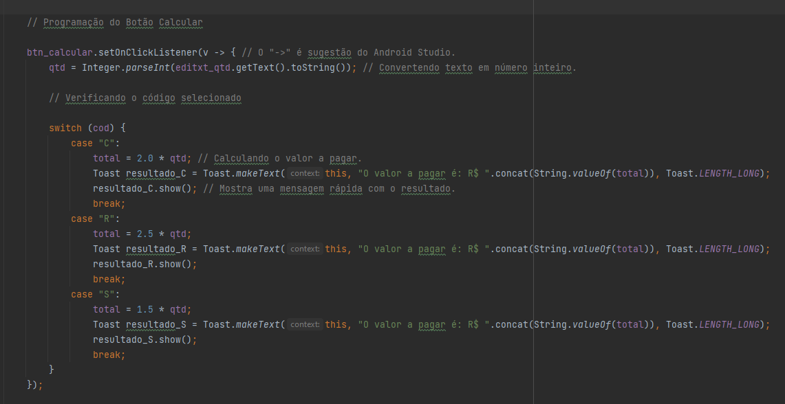

# App_Exercicios

## Dados

 Nome: Marcos Vinícius Barros Freire; 

 Nome: Marina Oliveira da Silva; 

 Turma: 2° PI - DS 

 Orientador: Prof° Aline Brito; 

 Sobre o projeto: App com finalidade de praticar exercícios em Java. O README será um arquivo onde será detalhado todo processo. 

## Índice
 
 * <a href="#t1"> Prints Git </a>
 * <a href="#t2"> Prints Android Studio </a>
 * <a href="#t3"> Execução do App</a>
 * <a href="#t4"> Elementos (Views) </a>
 * <a href="t5"> Referências </a>

<h2 id="t1">Prints Git</h2>

### Passo 1 (Criar um repositório)

  

### Passo 2 (Criar o projeto/pasta local)

  
  
 Escolher com qual tipo de View inciará o projeto 

   
  
  
 Definir liguagem que será utlizada, nome do projeto assim como, a API (compatibilidade) do projeto 

### Passo 3 (Abir o Git Bash)

  
  
 Ir na pasta onde se localiza o projeto, apertar com o botão direito do mouse. Após isso, basta clicar em mais opções (caso não apareça a opção "Git Bash here") e clicar em "Git Bash here"

### Passo 4 (Linkar repositório local e do servidor)

  
  
 Depois de abrir o Git Bash, vai no repositório do Git Hub e copie o link do mesmo 

   
  
  
 No Git Bash é necessário digitar o comando "git init", esse será o resposável por criar um repositório local. No caso o reósitório já existia.

  
 Depois disso é recomendado mudar o nome da branch. Por padrão será "master", entretanto, no repositótio do Git Hub geralmente o nome é main. Para não ter problemas com branch basta digitar o código "git branch -M "nome_da_branch". Nesse caso, o nome também já estava alterado. 

  
 Logo após, é necessário vincular o repositório local com o repositório que está no servidor. Para que isso seja possível basta utlizar o comando "git remote add origin link_do_repositório. No caso, o comando já tinha sido executado. 

  
 Depois, pega-se os arquivos que está no servidor e mescla com os arquivos locais, utlizando o comando "git pull --allow-unrelated-histories link_do_repositorio. 

### Passo 5 (Add, commit e push)

  
  
 Depois de todas as configurações iniciais, basta se utlizar alguns comandos para enviar os arquivos para o servidor. Primeiro começa-se com o "git add nome_do_arquivo". Esse comando permite monitorar os arquivos, basicamente é um pré-requisito para o commit. Caso queria, monitorar todos os arquivos basta colocar o ponto (.) no lugar do nome do arquivo.

  
 Para se certificar que quais arquivos estão sendo monitorados utliza-se o comando "git status". 

  
  
 Depois disso, basta dar o "commit" utlizando o comando "git commit -m "mensagem". 

  
  
 Para certificar-se quais foram os commits feitos é necessário digitar o comando "git log". 

  
  
 O commit foi realizado, porém, ainda não está no servidor. Para mandar para o mesmo, basta utlizar o comando "git push -u origin nome_da_branch".

  
 O 5° passo será o mais utlizado no decorrer do projeto, já que envolve commits. 

<h2 id="t2">Prints Android Studio</h2>

### Tela inicial (Home)

  
   
  

    
A tela home é a Activity onde dará acesso a todas outras   activity, ou seja, por ela é possível entrar na tela de   exercícios e dados.

    
Os elementos utlizados em sua totalidade foram:  ScrollView (Para ver os outros exercícios), TextView (Para   mostrar textos e outros), ImageButton (Para colocar um  icone clicável) e Linear Layout (Para organizar o Layout)

  

   
  
  
   
  

    
Na codficação foi utlizado códigos padrões. Adicionando funcionalidade de clicar nos ImageButton para ir para outra tela.

  
  

 

### Tela de Dados

  
   
   
  

    
A tela de dados é uma Activity auto-explicativa, onde, é utlizada para exibir alguns dados sobre a instituição e outros.

    
Em geral, nela foi utilizada elementos padrões, como TextViews, ImageButton, etc.

  

   
  

  
  

    
Na codficação foi utlizado códigos padrões. Adicionando funcionalidade de clicar nos ImageButton para ir para outra tela.

  
 

### Tela do Exercício 3

### Tela de Exercício 6

  
   
  

    
Na Activity do Exercício 6, corresponde a resolução do mesmo. Basicamente consiste em escolher um código (Produto), digitar a quantidade e descobrir qual o valor a pagar.

    
Os elementos utlizados foram: RadioButton (Para selecionar o código), RadioGroup (Para agrupar os RadioButton), ImageButton(Como ícones que levam a outras telas), Button(Para calcular), TextViews(Para apresentar textos), Toast(Para apresentar o resultado) e Linear Layout (Para organização de Layout)

  

  
No quesito da codificação foi utlizado comandos para verficar se o Radio estava selecionado, e depois um swich case para realizar determinada operação com a quantidade digitada dependendo do raio selecionado.

  
Inicalmento, essa verificação do código estava sendo feita com "If e Else" junto com o "equals", porém o Android Studio recomendou esta forma de estruturar o código.

<h2 id="t3">Execução do APP</h2>
 
<video src="video/Teste_de_execução.mp4">

